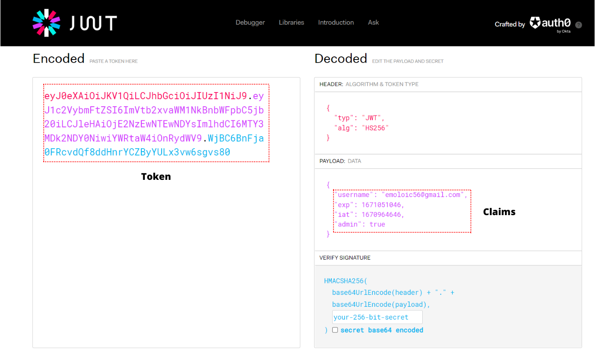

# Microservices Architecture and System Design with Python and Kubernetes

In this project, we'll be applying a microservices architecture to an application that will convert video files to MP3 files.

## 1- Microservices Architecture


When a user uploads a video to be converted to MP3 **(1).** That request will first hit the **API Gateway.** Our API gateway will send the JWT token provided by the user to the **authentication service** for verification and validation **(2).** Once the token has been validated by the authentication service **(3)**, the API Gateway will store the video in MongoDB **(5)** and put a message on our RabbitMQ queue letting downstream services know that there is a video to be processed in MongoDB. The **converter service** will consume messages from the queue **(6)**, it will then get the id of the video from the message, pull that video from MongoDB **(7)**, convert the video to MP3, then store the MP3 file to MongoDB **(8)**, then put a new message on the queue to be consumed by the **notification serice** that says that the convertion job is done **(9).** The notification service consumes those messages from the queue **(10)** and sends an email notification to the client, informing the client that the MP3 file for the video file that he/she uploaded is ready for download **(11).** The client will then use the unique id acquired from the notification service plus his/her JWT token to make request to the API Gateway to download the MP3 file **(12).** The API Gateway will first send the JWT token to the authentication service for verification anf validation **(13).** Once the token has been validated by the authentication service **(14)**, the API gateway will pull the MP3 file from MongoDB **(15)** and serve it to the client **(16).**

## 2- Applied Technologies

| Name | Scope |
| --- | --- |
| Python | Programming language |
| RabbitMQ | Message broker |
| Docker | Application containerization |
| Kubernetes | Container orchestration system for automating software deployment, scaling, and management. |
| MySQL | Relational database for storing our user credentials (email and password) |
| MongoDB | Document-oriented database for storing our Video and MP3 files |

## 3- Installation and Setup

The first thing that we're going to need to do before setting up any of our services is to install a few things. It's critical that we correctly install all these perequisites prior to setting up our services.

In this project, we'll be using the **Ubuntu Linux operating system** to build our application.

### 3.1- Python Installation using APT

**APT,** or **Advanced Package Tool** is the default package manager that you will find on Ubuntu. To install Python 3, open up your terminal and enter the following commands:

1. Update your local system's repository by entering the following command:
```bash
sudo apt update
```
2. Download the latest version of Python:
```bash
sudo apt install python3
```
3. APT will automatically find the package and install it on your computer.
4. Check the version of Python
```bash
python3 --version
```

### 3.2- Docker Installation

To install docker on Ubuntu, run the following commands in your terminal:

1. Docker Engine Installation
```bash
sudo apt-get -y install docker.io
```
2. Add User to Docker Group

By default, the docker command should run with root privileges. To run Docker as a non-root user in Ubuntu, you have to add the user to the docker group. Otherwise, you will receive an error. We will add the user `docker` to the docker group named `docker`. To do so, enter the following commands in your terminal.

```bash
sudo groupadd docker
sudo gpasswd -a $USER docker
sudo service docker restart
```
3. Check the version of Docker
```bash
docker --version
```

After the Docker installation is completely done, you need to create a free [DockerHub account](https://hub.docker.com/). **Docker Hub** is a hosted repository service provided by Docker for finding and sharing container images with your team. Key features include:
- **Public and Private Repositories:** Push and pull container images.
- **Automatic Builds:** Automatically build images from GitHub and Bitbucket and push them to Docker Hub.

### 3.3- kubectl Installation

The Kubernetes command-line tool, [kubectl](https://kubernetes.io/docs/reference/kubectl/kubectl/), allows you to run commands against Kubernetes clusters. You can use kubectl to deploy applications, inspect and manage cluster resources, and view logs. Kubectl is installable on a variety of Linux platforms. Please, refer to this link to [install kubectl on Linux](https://kubernetes.io/docs/tasks/tools/install-kubectl-linux)

Once the installation is done, you'll be able to check the version of kubectl by running the following command:

```
kubectl version
```

### 3.4- K9s Installation [Optional]

[K9s](https://k9scli.io/) is a terminal based UI to interact with your Kubernetes clusters. The aim of this tool is to make it easier to navigate, observe and managed your deployed applications in the wild. K9s continually watches Kubernetes for changes and offers subsequent commands to interact with your observed resources.

To install it on Linux, you need to first install the [Homebrew package manager](https://phoenixnap.com/kb/homebrew-for-linux). 

Once the installation is done. Run the following command:

```bash
brew install derailed/k9s/k9s
```

### 3.5- AWS Account Creation

We'll be deploying our application in [AWS](https://aws.amazon.com/fr/console/). **Amazon Web Services (AWS)** is the world's most comprehensive and broadly adopted cloud platform, offering 200 fully features services from data centers globally. For that reason, you need to [create an AWS account](https://aws.amazon.com/premiumsupport/knowledge-center/create-and-activate-aws-account/?nc1=h_ls).

### 3.6- eksctl Installation

We will use [eksctl](https://eksctl.io/) as a CLI tool for creating and managing kubernetes cluster on [AWS EKS](https://docs.aws.amazon.com/eks/latest/userguide/what-is-eks.html).

Before getting eksctl installed, you will need to install the [AWS CLI](https://docs.aws.amazon.com/cli/latest/userguide/getting-started-install.html) and the [aws-iam-authenticator](https://docs.aws.amazon.com/eks/latest/userguide/install-aws-iam-authenticator.html) in case they are not already installed.

Once these pre-requisites are fulfilled, install eksctl with the following commands. If you’re not using Linux, you can check the installation commands for your OS [here](https://github.com/weaveworks/eksctl#installation).

To run the latest release, run:

```bash
curl --silent --location "https://github.com/weaveworks/eksctl/releases/latest/download/eksctl_$(uname -s)_amd64.tar.gz" | tar xz -C /tmp
sudo mv /tmp/eksctl /usr/local/bin
```

Prior to the deployment; you will need to configure your AWS credentials using the AWS CLI. In order to do so, you will need an AWS **secret key** and **access key** pair. If you don't have one yet, you can create a new one in the AWS IAM console. Check this [documentation](https://docs.aws.amazon.com/general/latest/gr/aws-sec-cred-types.html#access-keys-and-secret-access-keys) as a guide.

Keep in mind that the user which uses those credentials should have permissions to create the infrastructure. For this example, you can use the `AdministratorAccess` managed policy. Store well your credentials, and once this user is no longer needed, remove it, to avoid unnecessary risks. In the image below, I have created a user called `eksUser` with the `AdministratorAccess` policy assigned to him.


To manage AWS services from the terminal with AWS CLI, you need to add your user credentials (secret key and access key). We will create a profile called `eksUser` and provide the user credentials.

```bash
aws configure --profile eksUser
```

### 3.8- Create and Connect to a MySQL Database with Amazon RDS

We need to create a MySQL database for the authentication service to store our user credentials `(email and password)`. To do so, we will use the AWS service called [Amazon RDS](https://aws.amazon.com/rds/?trk=2459a122-ecea-4c0d-880d-c1d60c82c1d0&sc_channel=ps&s_kwcid=AL!4422!3!548915588280!e!!g!!amazon%20relational%20database&ef_id=Cj0KCQiAnNacBhDvARIsABnDa6-EkMahbn_NVAUrxD3KJ7Hf5Ni7Bf0XvYhAJ5IXdUqBOwRRyM5yj7oaAmE9EALw_wcB:G:s&s_kwcid=AL!4422!3!548915588280!e!!g!!amazon%20relational%20database) to create a MySQL Database instance. Click this [documentation](https://aws.amazon.com/getting-started/hands-on/create-mysql-db/) as a guide.  

**Note:** By default, AWS will not automatically create a database on the instance you are creating. Make sure to provide a name in the `database name` field of the form. For this project, I have added a database called `auth`.

Once the database instance creation is complete and the status change to available, you can connect to the database on the DB instance using any standard SQL client. In this step, we will download [MySQL Workbench](https://www.mysql.com/products/workbench/). Go to the [Download MySQL Workbench](http://dev.mysql.com/downloads/workbench/) page to download and install MySQL Workbench.

Prior to connect to the MySQL Database, we need to add an **inbound rule** to the security group of our database instance to allow inbound traffic from anywhere.


In this step, we will connect to the database you create using MySQL Workbench.

1. Launch the MySQL Workbench applcation and go to **Database > Connect to a Database** (Ctrl+U) from the menu bar.
2. A dialog box appears. Enter the following:
- **Hostname:** You can find your hostname on the Amazon RDS console as shown in the screenshot to the right.
- **Port:** The default value should be **3306.**
- **Username:** Type in the username you created for the Amazon RDS database. For this project it is `auth`.
- **Password:** Click *Store in Vault* (or *Store in Keychain on macOS*) and enter the password that you used when creating the Amazon RDS database.

Click **OK.**


3. You are now connected to the database! On the MySQL Workbench, you will see various schema objects available in the database.


4. It's time to create a table called `user` in our database `auth`. To do so, simply run the following command in the **Query** tab.

```bash
USE auth;

CREATE TABLE user (
    id INT NOT NULL AUTO_INCREMENT PRIMARY KEY,
    email VARCHAR(255) NOT NULL UNIQUE,
    password VARCHAR(255) NOT NULL
);
```


### 3.9- Create and Connect to a MongoDB with MongoDB Atlas

[MongoDB Atlas](https://www.mongodb.com/atlas/database) is a fully-managed cloud database that handles all the complexity of deploying, managing, and healing your deployments on the cloud service provider of your choice (AWS , Azure, and GCP). MongoDB Atlas is the best way to deploy, run, and scale MongoDB in the cloud. With Atlas, you’ll have a MongoDB database running with just a few clicks, and in just a few minutes. There provide a **free tier MongoDB Cluster** that we will use in this project.

To create a free MongoDB cluster, click this [documentation](https://www.mongodb.com/basics/mongodb-atlas-tutorial) as a guide.

**Note:** During the creation of the cluster, keep in mind that you need to specify the **IP addresses** that can access your cluster. For this project, I selected the button `Allow Access from Anywhere`.

Once the cluster creation is done. You need to create two databases (`videos` and `mp3s`). Click this [documentation](https://www.mongodb.com/docs/atlas/atlas-ui/databases/#std-label-atlas-ui-dbs) as a guide.

Now that we have set up our MongoDB cluster and create our databases. Make sure to take notes of your MongoDB cluster credentials (`username`, `password`, `endpoint url`).

## 4- Microservices

As mentioned before, our microservices are going to be running in a Kubernetes cluster and that cluster's internal network is not going to be accessible to or from the outside world (internet). Our client is going to be making request from outside of the cluster with the intention of making use of our distributed system deployed within our Kubernetes cluster via our API Gateway. So our API Gateway service is going to be the entrypoint to the overall application and the API Gateway service is going to be the service that receives request from the client and it is also going to be the service that communicates with the necessary internal services to fulfill the request received from the client. If our internal services leave within a private network, how do we determine when we should allow requests in from the internet? This is where our `authentication service` comes in.

### 4.1- Authentication service

We can give clients access to our application by creating credentials for them within our `auth` database. The client will first sign up by making a request to the `/registration` endpoint and provide his/her **username(email)** and **password**. The username and the hashed password of the client will be stored in our MySQL database's table `user`. Any (user, password) combination that exists within our MySQL database's table `user` is a (user, password) combination that will be granted access to our application's endpoints. This is where the authentication scheme called **Basic Authentication**  comes in. This authentication scheme requires the client to provide a username and password in the request which should be contain within the header field of the form `Authorization: Basic <credentials>` where credentials is the **base64 encoded** of the username and password joined by a single colon (eg: `Authorization: Basic base64(username:password`). In the context of our authentication flow, we are going to make use of this authentication scheme by taking the *username* and *password* from the Authorization header when the client sends a request to our `/login` endpoint and comparing them to what we have in our MySQL database. If we find the match for the credentials, we know that the user has access, so we will return a **JSON Web Token** to the client which the client will use for subsequent requests to our API Gateway endpoints (`/upload` and `/download`). Basic Authentication should only use in conjunction with other security mechanisms such as **HTTPS/SSL** for security reasons.

#### 1- JSON Web Tokens (JWTs)

A JSON Web Token is basically just two JSON formatted strings and a signature which comprises three parts (each part being Base64 encoded). All three parts are merged together seperated by a single dot **(.)**. But What are these three parts?



**1.1- HEADER:**

The header contains a key-value pair for both the **signing algorithm** and the **type of the token** which is of course **JWT**.

The **signing algorithm** is the algorithm that was used to sign the token which will allow us to later verify that the sender is who he says he is and to ensure that the message wasn't changed. 

They are both **Asymmetric algorithms** with two keys (a private and a public key), and a **Symmetric algorithms** which use only one private key that must be kept secret. Our authentication service is going to be using a symmetric signing algorithm **HS256 (HMAC with SHA-256).** For example, our authentication service is going to be the only entity that knows our single private key and when a client logs in using Basic Authentication, our authentication service will create a JSOM Web Token and signs it using our private key. That JWT will then be return to the client. That way, when a user make following requests to our API Gateway service, it will send a JWT in the request and our authentication service can validate the token using the single private key. If the token was signed using another key, our authentication service will know that the token is invalid. It is important that we know that the JSON formated data in the token hasn't been tampered with, because that data is going to contain the access's permissions for the user. So without this signing algorithm, if the client were to alter the JSON data and upgrade his permissions to encrease his permissions allowing itself access to resources that shoudn't be available to that particular user, then at that point our entire system will be compromised.

**1.2- PAYLOAD:**

The payload contains the **claims** for the user or the **Bearer** of the token. **Claims** are just pieces of information about the user. For the most part, this claims are defined by us although there are pre-defined claims as well. The claims that we are going to define on our own are: the **username,** whether or not the user has admin privileges which in our case is just going to be `True` or `False`.

**1.3- SIGNATURE**

The last part of the token is the **signature**. The signature is created by taking the **Base64 encoded header,** the encoded payload and our private key and signing them using the signing algorithm which will be in our case **HS256.**

Now, whenever a client makes request to our API Gateway service and provide the token within the request, we can determine if the client's token was indeed signed with our private key and our signing algorithm. And if so, we can determine the client's access level by checking the claims in the payload portion of the token. In our case, we are simply going to allow the client access to all our endpoints if a claim that we are going to call `admin` has a value of `True` when we decode the payload portion of the token.(`admin:True`)

#### 2- Authorization header

For the **Basic Authentication Scheme,** we will need to have the word `Basic` in our Authorization header. But for our JWT, we instead need to have the word `Bearer` in the Authorization header that includes the token (eg: `Authorization: Bearer <token>`). For more information, click this [documentation](https://reqbin.com/req/c-hlt4gkzd/curl-bearer-token-authorization-header-example) as a guide.

### 4.2- API Gateway service

Once our user's request for updoaling a video file has been validated by our authentication service, Our API will use **GridFS** to store the video file in MongoDB database.

#### 4.2.1- What is GridFS?

For this project, we will use MongoDB to store our videos and MP3 files. In the [documentation](https://www.mongodb.com/docs/manual/reference/limits/), we can see that the maximum document size is **16 megabytes.** They explain that the maximum document size helps ensure that a single document cannot use excessive amount of RAM or, during transmission, excessive amount of bandwidth. To store documents larger than the maximum size, MongoDB provides the **GridFS API.** 

The reason we are actually using GridFS is because working with video files, there is a high probability that we'll eventually be working with files larger than 16MB. 

**How does it work ?**

[GridFS](https://www.mongodb.com/docs/manual/core/gridfs/) divides the file into parts, or chunks, and store each chunk as a seperate document. By default, GridFS uses the default chunk size of 255 kB; that is, GridFS divides a file into chunks of 255 kB with the exception of the last chunk. The last chunk is only as large as necessary. Similarly, files that are no larger than the chunk size only have a final chunk, using only as much space as needed plus some additional metadata.

GridFS uses two collections to store files. One collection stores the file chunks, and the other stores file metadata. 

- `chunks` stores the binary chunks.
- `files` stores the file's metadata

GridFS places the collections in a common bucket by prefixing each with the bucket name. By default, GridFS uses two collections with a bucket named `fs:`

- `fs.files`
- `fs.chunks`

If you want to learn more about GridFS, visit the [documentation page](https://www.mongodb.com/docs/manual/core/gridfs/).

Once the video file is stored in MongoDB, the API Gateway service sends a message in a RabbitMQ queue letting downstream services know that there is video to be processed in MongoDB.

#### 4.2.2- How RabbitMQ is going to integrate with our overall architecture ?

We already know how the authentication flow works, so we don't need to go over that again. But let's now go over how RabbitMQ integrates with our overall architecture. When a user uploads a video to be converted in MP3, that request will first hit our API Gateway service. Our API Gateway service will then store the video in MongoDB and then put a message on our RabbitMQ queue letting downstream servives know that there is a video to be processed in MongoDB. The converter service will consume messages from the queue, it will then get the id of the video from the message, pull that video from MongoDB, convert the video to MP3, then store the MP3 file on MongoDB, then put a new message on the queue to be consumed by the notification services that says that the conversion job is done. The notification service consumes those messages from the queue and sends an email notification to the client informing the client that the MP3 file for the video that he/she uploaded is ready for download. The client will then use the unique id acquired from the notification service plus his/her JWT to make a request to the API Gateway service to download the MP3 file and the API Gateway service will pull the MP3 file from MongoDB and serve it to the client. That is the overall conversion flow and how RabbitMQ is integrated with the overall system.

Now that we have a clear understanding of the overall flow of our system, we can know use that understanding to familiarize ourselves with some key terms when considering Microservices Architecture.

Both terms are:

#### 1- Interservice Communication (Asynchronous and Synchronous)

**1.1- Synchronous Interservice Communication**

It simply means that the client sending the request awaits the response from the service that it is sending the request to. The client can't do anything while it waits for this response, so it is essentially **blocked.** This request is considering a **Blocking request.** 

For example, our API Gateway service communicates with our authentication service **synchronously.** So when the gateway sends an HTTP POST request to the notification service to log in a user and retreive a JWT for that user, our API Gateway service is blocked until the authentication service either returns the JWT or an error. Communication between our API Gateway service and our authentication service is **synchronous** which makes those services **tightly coupled.**

**1.2- Asynchronous Interservice Communication**

With Asynchronous Interservice Communication, the client doesn't need to await the response of the downstream service. Therefore this is considered a **non-blocking request.** This is achieved in our case by using a **queue.**

For example, in our architecture, our API Gateway service needs to communicate with our converter service, but if our API Gateway service were to communicate with our converter service in a synchronous manner, the performance of our API Gateway will take a hit because if the gateway were to get many requests to convert large videos, the processes that make requests to the converter service will be blocked until the converter service finishes processing the videos. This is where our queue comes in the picture. As explain before, our API Gateway service doesn't communicate directly with our converter service, therefore it doesn't depend on the converter service's response. This means that in our current architecture, our API Gateway service and our converter service are **loosely coupled.** This decoupling is done by using a **queue.** Our API Gateway service just stores the videos in MongoDB and throws a message on the queue for a downstream service to process the videos at its convenience. In this case, the only thing holding up the threads on our API Gateway service is the uploading of the video to MongoDB and putting the message on the queue which means that our API Gateway service's threads will be free up much quicker allowing for our API Gateway service to handle more incoming requests. With the current architecture, our API Gateway service is asynchronously communicating with our converter service. That is, it sends requests to the converter service in the form of messages on the queue but it doesn't need to wait for nor doesn't care about the response from the converter service. It essentially just sends and forgets the message. This same thing is happening with the communication between the converter service and the notification service.

#### 2- Consistency (Strong and Eventual)

**2.1- Strong Consistency**

Let's start with an example of what our application flow would look like if it were **strongly consistent.** Let's says that hypothetically, whenever a user uploads a video to our API Gateway service to be converted to MP3, we make a synchronous request to our converter service waiting for the conversion to complete and then in response the converter service sends an id for the MP3 back to the user once the conversion is complete. At the point that the user receives that id, it's certain that the video has been processed and conversion done to MP3 and that the data is consistent. At that point, if the user were to request to download the data based on the id, the user is guaranteed to get the most recent update of that data. That is **strong consistency.**

**2.2- Eventual Consistency**

Let's use our actual architecture as an example on this case. Let's says that hypothetically, when our API Gateway service uploads the video to MongoDB and puts a message on the queue to be processed, we return a download id to the user at that point. If the user were to upload the video that takes one minute to be processed but immediately after receiving the id, the user tries to download the MP3, the MP3 will be not yet available because it will still be processing in that case, but the MP3 would be *eventually* available. So if the user were to wait one minute and then request to download the MP3 with that same id, at that point, the MP3 will be available, therefore the data will be **eventually consistent.** That is Eventual Conistency.

#### 4.2.3- How does RabbitMQ fit into our architecture ?

For our purposes, we are going to use a very basic RabbitMQ configuration but we need to go over a couple of things so we have a clearer understanding of what happening here.


The first important thing to understand is that our producer which is the service that is putting the messages on the queue isn't publishing the messages directly to the queue. It actually sends the messages to an **Exchange.** The exchange is basically a middleman that allocates messages to their correct queue. Throughout the lecture of this documentation, I have been referring to RabbitMQ as if it were a single queue but under the hood, we actually can configure multiple queues within one RabbitMQ instance. For example, in our case, we will make use of both a queue that we'll call `video` and a queue that we'll call `mp3`. So when our producer publishes a message to the Exchange, the Exchange will route the message to the correct queue based on some cricteria. How does our Exchange routes messages to the correct queue in our case ? Since we are going with a simple RabbitMQ configuration for the sake of brevity. We are using the **default exchange.**

The **default exchange** is a direct exchange with no name (empty string) pre-declared by the broker. It has one property that makes it very useful for simple applications. Every queue that is created is automatically bound to it with a routing key which is the same as the queue name. For example, when we declare a queue with the name of `video`, the broker will bind it to the default exchange using `video` as the routing key (in this context sometimes referred to as the binding key). Therefore a message published to the default exchange with the routing key `video` will be routed to the queue `video`. In other words, the default exchange makes it seem like it is possible to deliver the messages directly to queues, even though that is not technically what is happening. 

Let's say that the producer is our API Gateway and the consumer our converter service. When a user uploads a video, our API Gateway stores the video and then publishes a message to the exchange that is designated for the `video` queue. This exchange will route that message to the video queue and downstream service which is the consumer of the video queue will process the message. The consumer (converter service) will process the message by pulling the video from MongoDB, converting it to MP3, storing the MP3 on MongoDB and then publishing a message to the exchange that is intended for the `mp3` queue. 

Let's focus on the `video` queue for now. Let's say for example our producer is paddling on more messages than our one consumer can't process in a timely manner. This is where the capability to scale up our consumer service comes into the picture. If we are going to scale up, our queue actually needs to be able to accomodate multiple instances of our consumer service without bottlenecking the entire flow. How do we manage that? We manage that by making use of a pattern called **Competing Consumers Pattern.**

**Competing Consumers Pattern**


This pattern simply enables multiple concurrent consumers to process messages received on a same messaging channel. That way, if our queue is packed full of messages, we can scale up our consumers to process the messages concurrently resulting in more throughput. Luckily, by default our RabbitMQ queue will dispatch messages to our consuming services using the [round robin algorithm](https://en.wikipedia.org/wiki/Round-robin_scheduling) which satisfies our needs. This basically just means that the messages will be distributed more or less evenly amongst our consumers.

**Note:** We are using the python client library called [pika](https://pika.readthedocs.io/en/stable/) to interact with our RabbitMQ service.

### 4.3- Converter service

As already mentioned, the converter service will get the message from the queue and then pull the video from MongoDB and convert it to MP3 and store the MP3 on MonogDB. Then, send a message on the `mp3` queue. 

**NB:** The Python library we're using to convert video to MP3 is called [moviepy](https://pypi.org/project/moviepy/).

### 4.4- Notification service

The notification service is responsible to receive the message from the `mp3` queue and then sends an email notification to inform the client that the conversion is done. The notification service will be able to send the message to the client by using the value of the field `username` from the message which is essentially the email of the client. The email has been retreived from the payload of the JWT. We are going to use **Google SMTP server** (which is the same SMTP server that Gmail uses) within our application to send emails.

An **SMTP server** is a mail server that can send and receive emails using the SMTP protocol. We will use the library called [smtplib](https://docs.python.org/3/library/email.examples.html).

To do that, we need a sender address which is the address that we will use to send the email. **I recommend that you create a** [dummy Gmail account](https://support.google.com/mail/answer/56256?hl=en) **to send the email because in order for this to work, within our Gmail account we need to enable or authorize non-google applications to log into our Gmail account.** The default setting when we create a Gmail account is like only google applications can log into that account. But in order for this application to log into your account, you are going to have to authorize non-google applications. That means, any non-google applications can log into your Gmail account if they have your credentials. **It's not recommended to use your actual Gmail account for this.**

To authorize non-google applications, refer to this [Youtube video](https://www.youtube.com/watch?v=uVDq4VOBMNM) of 5 minutes. Make sure to save the **Gmail App Password** you will generate, this password will be use as our credentials to send email notifications. You can not see this password again if you do not copy it. The email and the password generated will be use by the notification service to sends email notifications.

## 5- Application Containerization

Prior to deploy our application in our Kubernetes cluster, we first need to build our docker images.

To do this, you need to first clone this repository by using the following command in your terminal:

```bash
git clone https://github.com/emoloic/microservices-architecture_python-kubernetes.git
```
Then enter to the project directory, and open the directory `services`:

```bash
cd services
```
For each service, you need to build a docker image and push them in your DockerHub repository.

To do so, you need to first log into your account from your terminal by providing your credentials (`username` and `password`):

```bash
docker login -u <docker-username> -p <docker-password>
```

Once login, let's build our docker images.

### 5.1- Authentication service

1. Open the directory `auth`

```bash
cd auth
```
There is already all the required files to build your image. Please take time to go through each file to understand the code. The code is commented to help you understand what we are doing. The file called `Dockerfile` is the one responsible for building our image. Let's call this image `auth` by using the flag `-t`.

2. Build your docker image

Simply run the following command:

```bash
docker build -t auth .
```

Now that the image has been built, you need to push this image into your DockerHub repository. To do so, you need to tag your image by providing your DockerHub username. Replace your username in the following command:

```
docker tag auth <docker-username>/auth:latest
```
In this case, we will the tag `latest` to tag this image. It simply means that this is the latest version of our image.

3. Push your docker image to Docker Hub

To push your docker image to Docker Hub, run the following command:

```bash
docker push <docker-username>/auth:latest
```
Now, you can go into your Docker Hub account and you will be able to see your new repository called `auth` with an image with the tag `latest`.

Now, let's build the other docker images for the remaining services.

### 5.2- API Gateway service

1. Open the folder `gateway`

```bash
cd gateway
```

2. Build your docker image

```bash
docker build -t gateway .
```

3. Tag your image

```bash
docker tag gateway <docker-username>/gateway:latest
```

4. Push your docker image to Docker Hub

```bash
docker push <docker-username>/gateway:latest
```

### 5.3- Converter service

1. Open the folder `converter`

```bash
cd converter
```

2. Build your docker image

```bash
docker build -t converter .
```

3. Tag your image

```bash
docker tag converter <docker-username>/converter:latest
```

4. Push your docker image to Docker Hub

```bash
docker push <docker-username>/converter:latest
```

### 5.4- Notification service

1. Open the folder `notification`

```bash
cd notification
```

2. Build your docker image

```bash
docker build -t notification .
```

3. Tag your image

```bash
docker tag notification <docker-username>/notification:latest
```

4. Push your docker image to Docker Hub

```bash
docker push <docker-username>/notification:latest
```

Once all your docker images have been built and pushed to Docker Hub. We need to deploy those images in our Kubernetes Cluster. Let's do that!!!

## 6- Deployment | Elastic Kubernetes Service (EKS)

Prior to deploy our application in our Kubernetes Cluster. There are key concepts that you need to know.

Here is the list of all the concepts that you **must** understand before moving to the next part:

- [Pods](https://kubernetes.io/docs/concepts/workloads/pods/)
- [Deployments](https://kubernetes.io/docs/concepts/workloads/controllers/deployment/)
- [StatefuSets](https://kubernetes.io/docs/concepts/workloads/controllers/statefulset/#:~:text=StatefulSet%20is%20the%20workload%20API,on%20an%20identical%20container%20spec.)
- [Service](https://kubernetes.io/docs/concepts/services-networking/service/)
- [ConfigMaps](https://kubernetes.io/docs/concepts/configuration/configmap/)
- [Secrets](https://kubernetes.io/docs/concepts/configuration/secret/)
- [Persistent Volume, Persistent Volume Claim and Storage Classes](https://www.youtube.com/watch?v=0swOh5C3OVM&t=5s)

This [Kubernetes Handbook](https://www.freecodecamp.org/news/the-kubernetes-handbook/) can also be a good guide for you to understand those concepts through an example.

**Note: I suppose you already know all the concepts mentioned above before moving to this section.**

### 6.1- Create a Kubernetes cluster with eksctl

We will create a Kubernetes cluster of 2 nodes. The machine type that we are going to be use for this project is an `t3.medium` **(2vCPU and 4GiB of RAM).** This will be enough for this project, you can change the machine type as you like. Refer to this [documentation](https://www.amazonaws.cn/en/ec2/instance-types/) for more details on AWS EC2 instance types.

You can choose any region you like. In my case I have chosen `ap-south-1` as the region to create my Kubernetes cluster. We will use `2` nodes as the minimum and `2` as the maximum as well. We will use the version `1.21` of Kubernetes. You need to specify all those configurations inside the [cluster.yaml](services/cluster.yaml) file.

To create the cluster with eksctl, simply run the following command. If you have configured a profile with a different name, please make sure to replace the value of the flag `--profile` with your profile.

```bash
eksctl create cluster -f services/cluster.yaml --profile eksUser
```

**Please, note that it will cost money to run a Kubernetes Cluster. After the demo, I will give you the command to delete your Kubernetes cluster so that it won't cost you money anymore.** 

### 6.2- Modify the Manifests files of each service to set up your own parameters.

For each service, you need to customize the manifests files presented in the directory `manifests`.

Let's start with the **RabbitMQ** service.

#### 1- RabbitMQ service

For RabbitMQ, instead of making a Deployment, we will use a [StatefulSet](services/rabbit/manifests/statefulset.yaml). We want our queue to remain intact even if the pod crashes. If you have read all the lectures from the links I have attached at the beginning of this section, you already know that each pod in a StatefulSet has a **persistent identifier** that remains accross any rescheduling. If the pod fails, the persistent pod identifier makes it easier to match existing volume to the new pod that replaces any data failed.

**How the data is persisted in our queue?**

The location `/var/lib/rabbitmq` is where RabbitMQ is going to store the queue when we create a durable queue, and the messages when we configure them to be persistent. We will use [EBS (Elastic Bloc Storage)](https://docs.aws.amazon.com/AWSEC2/latest/UserGuide/AmazonEBS.html) as a persistent volume by setting the value of `storageClassName` equals to `gp2` when defining the [persistent volume claim](services/rabbit/manifests/pvc.yaml).

Our [service](services/rabbit/manifests/service.yaml) will listen on port `5672`. However we can have access to our RabbitMQ user interface from the web by allowing inboud traffic on port `15672`. We have called our RabbitMQ service `rabbitmq`.

#### 2- Authentication service

You need to set your own docker image in the [Deployment file](services/auth/manifests/auth-deploy.yaml) and configure the ConfigMap and Secret files with your credentials.

For the [ConfigMap file](services/auth/manifests/configmap.yaml), you need to provide the following environment variables:
- `MYSQL_DATABASE_HOST` (the endpoint url of your MySQL instance)
- `MYSQL_DATABASE_USER` (your MySQL username)
- `MYSQL_DATABASE_DB` (your MySQL database name)
- `MYSQL_DATABASE_PORT` (the default port for MySQL which is `3306`)

For the [Secret file](services/auth/manifests/secret.yaml), you need to provide the following environment variables:
- `MYSQL_DATABASE_PASSWORD` (your MySQL password)
- `JWT_TOKEN`: (the secret that the authentication service will use to sign the JWT)

#### 3- API Gateway service

You also need to set your own docker image in the [Deployment file](services/gateway/manifests/gateway-deploy.yaml) and configure the ConfigMap and Secret files with your credentials.

For the [ConfigMap file](services/gateway/manifests/configmap.yaml), you need to provide the following environment variables:
- `AUTH_SVC_ADDRESS` (the endpoint url of our authentication service. Our gateway need this endpoint in order to communicate with our authentication service.)
- `MONGODB_USERNAME` (your MongoDB username)
- `MONGODB_CLUSTER_URL` (the endpoint url of your MongoDB cluster)
- `MP3_QUEUE` (the name of our queue for MP3 which we will call `mp3` as the default value)
- `VIDEO_QUEUE` (the name of our queue for Video which we will call `video` as the default value)

For the [Secret file](services/gateway/manifests/secret.yaml), you need to provide the following environment variable:
- `MONGODB_PASSWORD` (your MongoDB password)

Our API Gateway service sits in our cluster which is our private network but we need to allow request from outside of our cluster to hit our [API Gateway services](services/gateway/manifests/service.yaml) endpoints. We will do this by using **LoadBalancer** as a type of Kubernetes service. This type of service consists of a load balancer that is essentially the entrypoint to our cluster. Since this load balancer is the entry point to our cluster, it can actually route traffic to the cluster IPs within the cluster. In this case, it will route requests to our API Gateway service internal cluster IP. 

#### 4- Converter service

You also need to set your own docker image in the [Deployment file](services/gateway/manifests/gateway-deploy.yaml) and configure the ConfigMap and Secret files with your credentials.

For the [ConfigMap file](services/gateway/manifests/configmap.yaml), you need to provide the following environment variables:
- `MONGODB_USERNAME` (your MongoDB username)
- `MONGODB_CLUSTER_URL` (the endpoint url of your MongoDB cluster)
- `MP3_QUEUE` (the name of our queue for MP3 which we will call `mp3` as the default value)
- `VIDEO_QUEUE` (the name of our queue for Video which we will call `video` as the default value)

For the [Secret file](services/gateway/manifests/secret.yaml), you need to provide the following environment variable:
- `MONGODB_PASSWORD` (your MongoDB password)

**Note:** If you have noticed, we haven't created a service. Actually, we do not expose this service (we do not make request to the service). We only consume messages from the `video` queue.

#### 5- Notification service

You also need to set your own docker image in the [Deployment file](services/notification/manifests/notification-deploy.yaml) and configure the ConfigMap and Secret files with your credentials.

For the [ConfigMap file](services/notification/manifests/configmap.yaml), you need to provide the following environment variables:
- `GMAIL_ADDRESS` (the email address that our notification service will use to send email to the user)
- `MP3_QUEUE` (the name of our queue for MP3 from where the notification service will pull messages and send email to the user)

For the [Secret file](services/notifiction/manifests/secret.yaml), you need to provide the following environment variable:
- `GMAIL_PASSWORD` (your Gmail App Password generated from the email address we are using to send email to the user)

**Note:** We do not use a service here as well since we only consume messages from the `mp3` queue (no need to expose the service).

## 7- Demonstration

Now that we have our Kubernetes Cluster and our Manifests files ready. Let's deploy those manifests files in our Kubernetes Cluster. We will use the `default` namespace provided by Kubernetes. [Namespaces](https://kubernetes.io/docs/concepts/overview/working-with-objects/namespaces/) in Kubernetes are a way to organize clusters into virtual sub-clusters. They can be helpful when different teams or projects share a Kubernetes cluster.

### 7.1- Deployment of Manifests Files

To deploy the Kubernetes Manifests files of each service, let's run the following commands in our terminal.

#### 1- RabbitMQ service

```bash
kubectl apply -f services/rabbit/manifests
```

#### 2- Authentication service

```bash
kubectl apply -f services/auth/manifests
```

#### 3- Converter service

```bash
kubectl apply -f services/converter/manifests
```

#### 4- API Gateway service

```bash
kubectl apply -f services/gateway/manifests
```

#### 5- Notification service

```bash
kubectl apply -f services/notification/manifests
```

### 7.2- Interaction with our Kubernetes Objects

We can know view all the Kubernetes objects created in our cluster.

#### 1- Pods

```bash
kubectl get pods
```


#### 2- Deployments


#### 3- Services


As you can see in the image above, we have created a service of type **LoadBalancer** for our API Gateway. We will use this external IP address as the entrypoint to our application. **You will get a different domain name.** Please note this address since we are going to use it later to test our application. 

You can also see the load balancer that has been created in the AWS Console. To do so, go the region where you deployed your Kubernetes cluster (In my case, I have deployed my cluster in the region `ap-south-1` ie **Mumbai**), then go to `Services -> EC2 -> Load Balancing -> Load Balancers`.


#### 4- Statefulsets

```bash
kubectl get statefulsets
```


#### 5- Persistent Volume Claim 

```bash
kubectl get pvc
```


We can see that Kubernetes has provisioned a persistent volume of 1Gi of storage to store our RabbitMQ queues and messages.

#### 6- ConfigMaps

```bash
kubectl get configmaps
```


#### 7- Secrets

```bash
kubectl get secrets
```


**Note:** We can also view those Kubernetes objects via the tool called **K9s** that we have already installed. Simply go to your terminal and enter the following command:

```bash
k9s
```

It will open a user interface to interact with your cluster.


### 7.3- Demo

Now that all our services are running. Let's test our application.

**Note:** We will use [curl](https://phoenixnap.com/kb/curl-command) to interact with our applicaion in the terminal. **curl** (short for "Client URL") is a command line tool that enables data transfer over various network protocols. It communicates with a web or application server by specifying a relevant URL and the data that need to be sent or received. If you do not have curl install in your computer, simply run this command: 

```bash
sudo apt install curl
```

We can also use a GUI tools such as [Postman](https://www.postman.com/).

#### 1- Registration

We first need to register in order to have access to the application. To do so, we need to provide our `username` which refer to our email, and our `password`. We will perform a **POST request** since we are trying to send data in a JSON format to our application.

```bash
curl -X POST -H "Content-Type: application/json" -d '{"username": "emoloic2k22@gmail.com", "password": "Admin123"}' \
    http://aaf4454ed217b413fa6504d76f70d046-433649186.ap-south-1.elb.amazonaws.com/registration
```


You need to provide your own credentials. Don't forget to replace the endpoint url with your. We have used a python library called [bcrypt](https://pypi.org/project/bcrypt/) to hash the password of the user and store it to the database. **It's a best practise to never store password in plaintext.**

If evrything is OK, it will return a message saying that `User created`. 

#### 2- Login

Once registered, you can sign in by providing your credentials. If you remember, we will use a **Basic authenication.**

```bash
curl -X POST -u "emoloic2k22@gmail.com:Admin123" http://aaf4454ed217b413fa6504d76f70d046-433649186.ap-south-1.elb.amazonaws.com/login
```


Once authenticated, our API Gateway will return a JWT. We will use this JWT for subsequent requests to our load balancer. In our code, we have designed our Authentication service in such a way that the token generated will expire after **24 hours** ie **1 day.**

#### 3- Video Upload

Now that we are authenticated and a JWT has been provided by our application. We can use this JWT in the header of our requests to upload/download files.

To upload our video to be processed by our application, run the following command with your credentials. I already have a video in this repository called `video.mp4`, let's use it.


Once the video has been uploaded and stored in MongoDB, it will return a message `success!`. All we have to do now is waiting for the converter service to process the video and store it to MongoDB, then the notification service will send an email to inform us that the conversion is done and in meantime will provide the `fid` that is required to download the MP3 file. The image below shows the email received from our application with the `fid` of the MP3 file.


#### 4- MP3 Download

Now that we have received the `fid` of our MP3 file. We need to pass this id as parameter of the request when we want to download the file. To do so, simply run the following command. Always remember to include your JWT in the header of the request otherwise you won't have access.


I have called the MP3 file `output.mp3`. It's opt to you to named it whatever you like. 

**Congratulations, your MP3 file is dowloaded!!!**

### 7.4- Deleting our cluster

To delete our Kubenetes services, simply run the following commands:

#### 1- RabbitMQ service

```bash
kubectl delete -f services/rabbit/manifests
```

#### 2- Authentication service

```bash
kubectl delete -f services/auth/manifests
```

#### 3- Converter service

```bash
kubectl delete -f services/converter/manifests
```

#### 4- API Gateway service

```bash
kubectl delete -f services/gateway/manifests
```

#### 5- Notification service

```bash
kubectl delete -f services/notification/manifests
```

To delete  your Kubernetes cluster, simply run this command with the name of your AWS Profile:

```bash
eksctl delete cluster -f services/cluster.yaml --profile eksUser
```

This command will delete all resources created and it won't cost you money anymore. 

## 8- Improvements

We can improve this project by applying the following concepts:

1. **Setting up end-to-end TLS encryption**

Refer to this [documentation](https://aws.amazon.com/blogs/containers/setting-up-end-to-end-tls-encryption-on-amazon-eks-with-the-new-aws-load-balancer-controller/) as a guide.

2. **Setting our load balancer to be behind a domain name**

We can use the AWS service called [Route53](https://aws.amazon.com/route53/) to create a domain name and specify a route traffic to `Application and Classic Load Balancer` and the region where the load balancer is. It's much easy to use a custom domain name rather than the default domain name provided by AWS which is quite difficult to remember.

3. **Use Ingress Contoller instead of Load Balancers**

If our application will have multiple services to expose to the internet in the future, it won't be convenient to use a service of type LoadBalancer for each service (in fact, a LoadBalancer is an expensive resource). We could use [Nginx Ingress Controller](https://towardsdatascience.com/how-to-set-up-ingress-controller-in-aws-eks-d745d9107307). An NGINX Ingress Controller will only create a single load balancer, on that load balancer we are going to load balance all our services through the ingress object.

**Feel free to reach out to me on [Linkedin](https://www.linkedin.com/in/lo%C3%AFc-emo-siani-6757b6189/) if you have any problem.**

***Happy Learning :) !!!***